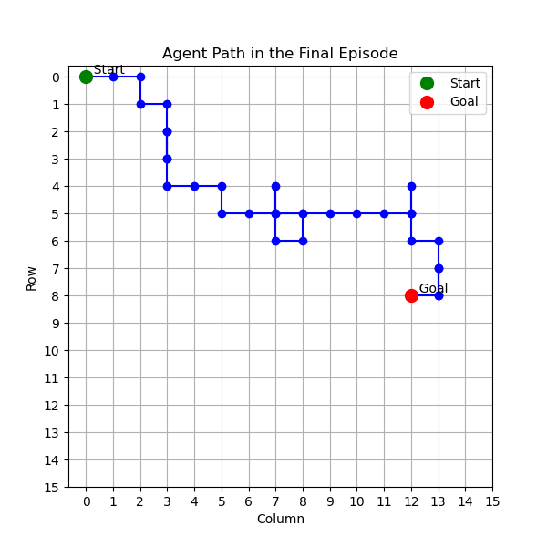

A simple implementation of a Model-Based Reinforcement Learning agent
using the Dyna-Q algorithm in a grid world environment.

The agent learns a model of the environment and uses it to plan
and update its Q-values, making it more sample-efficient than
a pure model-free approach.

